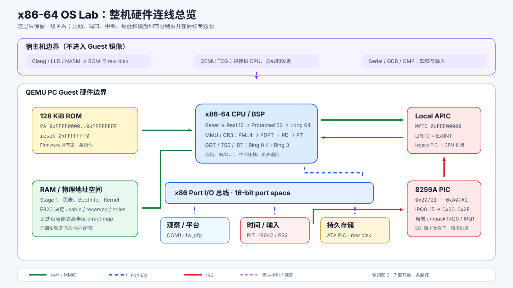
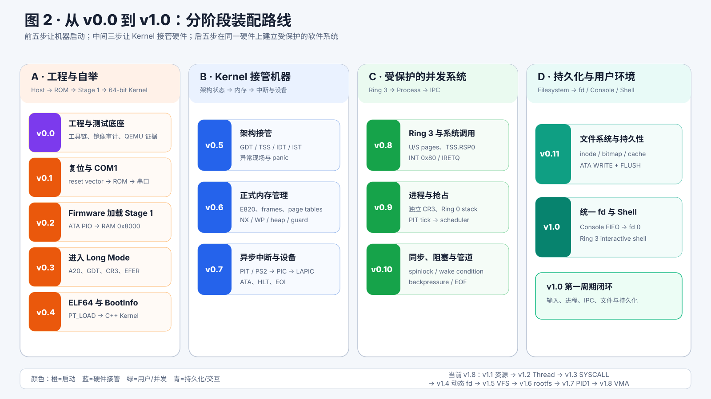
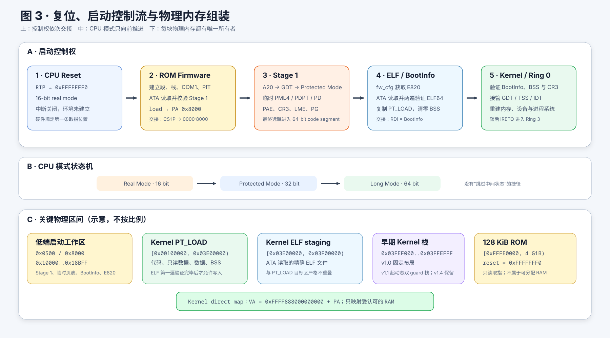
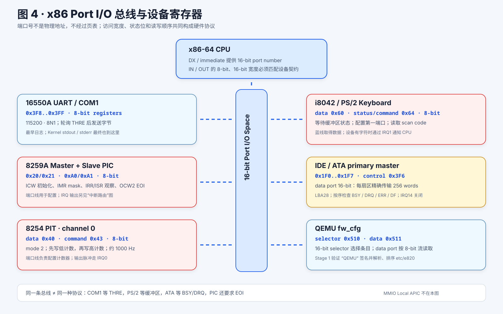
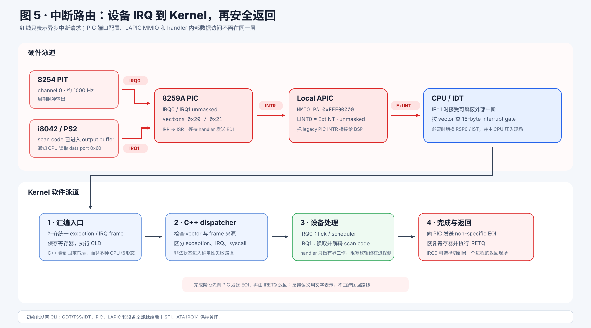
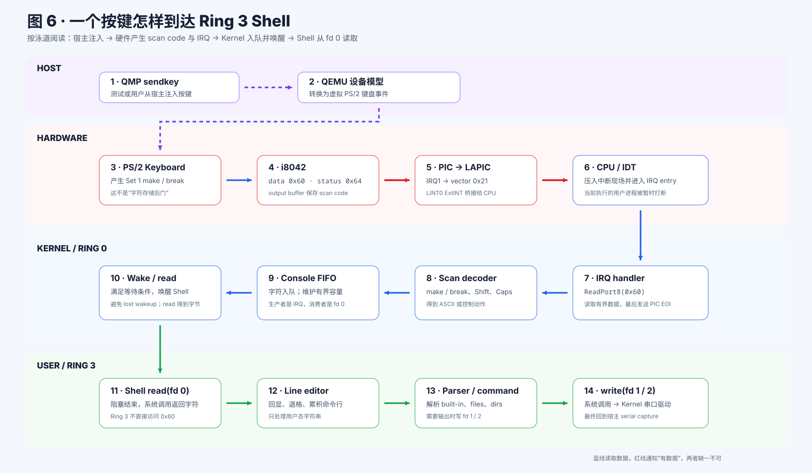
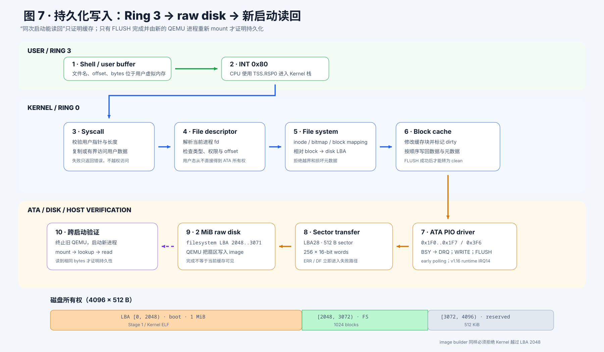

# 从 v0.0 到 v1.0：整机硬件组装与连线图册

这套图册把分阶段学习文档中的硬件知识放回同一台机器，但不再把所有地址、
端口、IRQ 和软件流压进一张图。总览只回答“有哪些部件”，六张专题图分别回答
“阶段怎样推进”“怎样启动”“端口怎样接”“中断怎样走”“按键怎样到 Shell”
和“文件怎样写进磁盘”。

| 图 | 单独打开 SVG | 只回答一个问题 |
| ---: | --- | --- |
| 1 | [整机低密度总览](assets/x86_64_os_hardware_wiring.svg) | ROM、CPU、RAM、Port I/O、PIC/LAPIC 和设备怎样一级连接 |
| 2 | [v0.0→v1.0 阶段路线](assets/hardware_stage_roadmap.svg) | 十三个版本分别接通什么能力 |
| 3 | [复位、启动与物理内存](assets/boot_and_memory_wiring.svg) | 控制权、CPU 模式和物理区间怎样交接 |
| 4 | [Port I/O 设备拓扑](assets/port_io_topology.svg) | 六组设备的端口、宽度和协议有什么不同 |
| 5 | [IRQ 中断路由](assets/interrupt_routing.svg) | IRQ0/IRQ1 怎样经 PIC、LAPIC、IDT 进入 Kernel 并返回 |
| 6 | [键盘到 Ring 3 Shell](assets/keyboard_to_shell.svg) | 一个按键怎样跨越 Host、硬件、Kernel 和 User 四层 |
| 7 | [文件写入与跨启动持久化](assets/storage_persistence.svg) | 一个用户字节怎样经过文件系统、ATA 和 FLUSH 写入 raw disk |

所有图片都是独立 SVG。点击表格链接或正文图片即可单独打开，放大后文字、
端口号、地址和数据流不会模糊。

[](assets/x86_64_os_hardware_wiring.svg)

### 实体电路对照图册

上面七张图仍然是 QEMU Guest 的系统连接，不是电子原理图。现实电源、连接器、
差分对和 PCB 网络单独收录在
[N100 载板电路详解](physical-carrier-circuit-guide.md)：

| 实体图 | 单独打开 SVG | 展开的连接 |
| ---: | --- | --- |
| 1 | [输入保护、汇流和电源树](assets/physical_carrier/power_wiring.svg) | DC、USB-PD、UPS、VDC、VIN、12 V、5 V、3.3 V |
| 2 | [高速接口逐根连线](assets/physical_carrier/high_speed_wiring.svg) | HDMI、USB、PCIe x4、M.2、RTL8111H 与 RJ45 |
| 3 | [低速控制与调试](assets/physical_carrier/control_wiring.svg) | 按键、风扇、RTC、UPS、I2C、UART、SPI |

完整的十页 KiCad 原理图 PNG 也在
[`assets/physical_carrier/reference/`](assets/physical_carrier/reference/)。

### 图形质量门禁

系统图采用三条强制规则：

- 单向箭头使用固定像素 marker，不随线宽放大。
- 连线不得使用 `marker-start`，避免箭头头部反向伸进源卡片。
- 每段连线必须避开所有卡片外围 8px 安全区；箭头端点额外预留 12px 可见净距。

三张实体电路图另有四条强制规则：

- 每个可见引脚必须拥有唯一 pin 标识和明确网络名。
- 每根导线必须真正经过对应引脚坐标，不能只把文字放在附近。
- 每个导线连通分量必须至少到达两个可见引脚。
- 未接脚必须标为 NC 且不得接线，图中禁止使用省略号代替线路。

修改任意图后运行：

```bash
python3 tools/check_learning_diagrams.py --self-test
```

检查器会解析 SVG 的正交 `M/L/H/V` 路径；系统图只要连线进入卡片安全区、
重新引入 `marker-start`，或把 marker 改回随线宽缩放就会失败；实体电路图
还会逐个检查 pin、net 和导线连通分量。

## 1. 先明确“组装”的含义

本项目运行在 QEMU TCG 模拟的 PC 上，没有需要插接的实体杜邦线。这里的
“硬件组装与连线”指 Guest 能观察到的真实硬件契约：

- CPU 通过物理地址读取 ROM 和 RAM。
- CPU 通过页表把虚拟地址翻译成物理地址。
- CPU 执行 `IN`、`OUT` 指令访问独立的 16 位端口 I/O 空间。
- 设备通过 IRQ、PIC 和 Local APIC 请求 CPU 执行中断入口。
- ATA 控制器把 512 字节扇区请求传递给逻辑 1 GiB 的稀疏 raw IDE disk。
- 宿主机只负责构建、启动、注入按键和采集观测证据，不进入 Guest 镜像替代
  固件、引导器或驱动。

因此图里的线不是电子原理图上的电压网络，而是“地址能到哪里、命令从哪里发出、
中断沿哪条路径返回、数据最终由谁拥有”的系统连线。

## 2. 统一图例：四种线不能混为一谈

| 线型 | 表示什么 | CPU 使用的机制 | 典型例子 |
| --- | --- | --- | --- |
| 绿色实线 | 内存或 MMIO | 普通 load/store，经 MMU 或物理地址访问 | ROM、RAM、Local APIC `0xFEE00000` |
| 蓝色虚线 | Port I/O | `IN` / `OUT`，端口号不参与页表翻译 | COM1 `0x3F8`、PIT `0x40`、ATA `0x1F0` |
| 红色实线 | IRQ / 中断请求 | 设备电平/脉冲 → PIC → LAPIC → CPU IDT | PIT IRQ0、键盘 IRQ1 |
| 紫色虚线 | 宿主控制或观测 | QEMU 参数、QMP、串口 capture、镜像构建 | `sendkey`、GDB stub、raw disk 生成 |

深灰箭头表示软件所有权或启动控制权交接，例如 ROM Firmware 跳到 Stage 1，
Stage 1 再调用 Kernel。总线类型相同不代表协议相同：COM1、PIC、PIT、PS/2
和 ATA 虽然都挂在 Port I/O 总线上，却有完全不同的寄存器、状态位和时序。

## 3. 从空机器开始，十三次接通能力

后半程并不总是增加新芯片。v0.8 以后更多是在同一套 CPU、内存和设备上增加
特权、所有权与软件抽象。

[](assets/hardware_stage_roadmap.svg)

| 阶段 | 新接通的部件或路径 | 该阶段应能看到的证据 |
| --- | --- | --- |
| v0.0 | 宿主工具链、镜像审计、QEMU TCG 测试底座 | 空 ROM、错误镜像和超时都能被自动判为失败 |
| v0.1 | reset vector → ROM Firmware → COM1 | CPU 从 `0xFFFFFFF0` 取指并出现第一条串口日志 |
| v0.2 | ROM → ATA PIO → raw disk → RAM `0x8000` | Stage 1 描述符和 CRC 通过，控制权到达 Stage 1 |
| v0.3 | A20、GDT、CR0/CR3/CR4/EFER、临时页表 | CPU 依次进入 16、32、64 位模式 |
| v0.4 | ATA Kernel ELF → staging → `PT_LOAD` → BootInfo | `RDI` 指向有效 BootInfo，C++ Kernel 获得控制权 |
| v0.5 | Kernel GDT、TSS、IDT、异常入口和 IST | `INT3` 自检可恢复，致命异常进入确定性 panic |
| v0.6 | fw_cfg E820 → 页帧分配器 → 正式页表与堆 | RAM holes 不被映射，CR0.WP、NX 和 guard page 生效 |
| v0.7 | PIT/PS2 → PIC → LAPIC LINT0 → CPU/IDT | IRQ0 tick、IRQ1 scan code、EOI 和 `HLT` 唤醒闭环 |
| v0.8 | Ring 3 页权限、TSS.RSP0、`INT 0x80`、`IRETQ` | 用户程序可调用内核，非法用户访问只终止自身 |
| v0.9 | 每进程 CR3、Ring 0 栈、PIT 抢占和调度器 | 多进程被 IRQ0 抢占并公平运行，退出资源被回收 |
| v0.10 | 等待条件、阻塞/唤醒、64 字节 pipe | Producer/Consumer 背压、EOF、broken pipe 正确 |
| v0.11 | fd → 文件系统/缓存 → ATA WRITE/FLUSH → disk | 文件跨 QEMU 重启仍存在，损坏元数据被拒绝 |
| v1.0 | IRQ1 → Console FIFO → fd 0 → Ring 3 Shell | 键盘可唤醒 Shell；无 Ready 进程时 CPU 执行 `HLT` |

## 4. 整台机器怎样连

### 4.1 复位、ROM 与第一条输出

[](assets/boot_and_memory_wiring.svg)

QEMU 把自研的 128 KiB ROM 映射到物理区间
`0xFFFE0000..0xFFFFFFFF`。x86 CPU 复位后从 `0xFFFFFFF0` 取第一条指令，
所以链接脚本必须把 reset stub 精确放在 ROM 顶部附近。Firmware 建立实模式
段和栈后，通过 Port I/O 初始化 COM1：

```text
CPU reset
  → PA 0xFFFFFFF0
  → 128 KiB ROM Firmware
  → OUT 访问 COM1 0x3F8..0x3FF
  → QEMU serial capture
  → 宿主测试读取日志
```

串口是最早的观测通道。此时还没有文件系统、屏幕驱动、系统调用甚至可用的 C++
运行环境；如果 COM1 没接通，后续失败只会表现成沉默。

### 4.2 内存总线、MMU 与物理布局

CPU 对 ROM、RAM 和 LAPIC MMIO 使用内存访问，对普通虚拟地址则先由当前
`CR3` 指向的四级页表完成翻译：

```text
virtual address
  → PML4 → PDPT → PD → PT（或 2 MiB PDE leaf）
  → physical address
  → RAM / ROM / MMIO
```

启动期关键物理区间如下。半开区间写法 `[begin, end)` 可以避免“末地址到底
算不算”的歧义。

| 物理区间 | 所有者 | 用途 |
| --- | --- | --- |
| `[0x00000500, 0x00000700)` | Firmware / Stage 1 | Stage 1 描述符 |
| `[0x00008000, 0x00010000)` | Stage 1 | Stage 1 负载和入口 |
| `[0x00010000, 0x00013000)` | Stage 1 | 临时 PML4、PDPT、PD |
| `[0x00013000, 0x00014000)` | Stage 1 | Kernel 描述符 |
| `0x00014000` 起 | Stage 1 → Kernel | BootInfo v2 与启动交接数据 |
| `[0x00100000, 0x03600000)` | Kernel ELF `PT_LOAD` | Kernel 代码、只读数据、数据和 BSS |
| `[0x03600000, 0x03E00000)` | Stage 1 | Kernel ELF 暂存区，最大 8 MiB |
| `[0x03FEF000, 0x03FFF000)` | 早期 Kernel | v1.0 固定初始栈及其 guard 布局 |
| `[0xFFFE0000, 0x100000000)` | Firmware | 128 KiB ROM |

Stage 1 的临时页表只解决“能进入 64 位并装载 Kernel”。v0.6 Kernel 根据
E820 重建物理页所有权和正式页表，只映射可用 RAM，保留洞，设置 `RW`、`U/S`
与 `NX`，并在高半区建立
`VA = 0xFFFF888000000000 + PA` 的 direct map。v1.1 又把 heap、buddy、
KVA 和动态双 guard 内核栈接在这套所有权模型之上，v1.8 继续在其上建立
Process/Thread、CpuLocal、KernelObject 和动态 FileTable；当前 v1.11
又增加文件 VMA、clean page cache、fork/COW、动态 Pipe 与外部 Shell，
但没有增加新的 QEMU 硬件。

### 4.3 Port I/O 总线上的设备

[](assets/port_io_topology.svg)

端口号不是物理地址，也不会经过页表。CPU 把端口号放入 `DX` 或指令立即数，
再执行对应宽度的 `IN`/`OUT`。当前机器实际使用：

| 设备 | 端口 | 方向和粒度 | 当前用途 |
| --- | --- | --- | --- |
| 16550A COM1 | `0x3F8..0x3FF` | 8 位寄存器 | 115200 8N1；轮询 THRE 后发送日志 |
| 8259A master PIC | `0x20/0x21` | 8 位 command/data | IRQ0..7、mask、ISR/IRR、EOI |
| 8259A slave PIC | `0xA0/0xA1` | 8 位 command/data | IRQ8..15；当前外设 IRQ 均不依赖它 |
| 8254 PIT channel 0 | `0x40`、`0x43` | 8 位命令和低/高计数 | 约 1000 Hz tick，输出 IRQ0 |
| i8042 / PS/2 | data `0x60`、status/command `0x64` | 8 位 | 配置第一端口、读取 scan code、输出 IRQ1 |
| ATA primary master | `0x1F0..0x1F7`、control `0x3F6` | 数据端口 16 位，其余 8 位 | LBA28、每扇区 256 words、同步 PIO |
| QEMU fw_cfg | selector `0x510`、data `0x511` | 16 位选择、8 位流读取 | Stage 1 获取并验证 `etc/e820` |

访问宽度是协议的一部分。ATA data port 必须按 16 位连续传输 256 个 word；
把它“简化”为 512 次 8 位读写并不等价。设备状态同样不是普通变量：ATA
必须按顺序检查 `BSY`、`DRQ`、`ERR` 和 `DF`，PS/2 必须等待输入/输出缓冲区
状态，UART 必须等待 THRE。

### 4.4 中断线：设备不能直接调用 C++ 函数

[](assets/interrupt_routing.svg)

当前系统使用 legacy PIC 的虚拟线模式。PIT 和键盘先把请求送入 8259A，
PIC 的 `INTR` 再接到 Local APIC 的 `LINT0=ExtINT`，最后由 CPU 根据 IDT
向量进入汇编入口：

```text
PIT channel 0 ── IRQ0 ──┐
                         ├─ 8259A PIC ─ INTR ─ LAPIC LINT0 ExtINT
PS/2 keyboard ── IRQ1 ──┘
                                      ↓
                              CPU 查 IDT 0x20 / 0x21
                                      ↓
                         汇编规范化现场 → C++ dispatcher
                                      ↓
                       PIC EOI → IRETQ 或切换后的 IRETQ
```

PIC 被重映射到 `0x20..0x2F`，因此 IRQ0 对应 IDT vector `0x20`，IRQ1 对应
`0x21`。当前只解除 IRQ0 和 IRQ1 的屏蔽。ATA IRQ14 保持关闭，磁盘驱动使用
同步轮询 PIO；图中 ATA 只有蓝色 Port I/O 线，没有红色 IRQ 线，这一点是
刻意设计，不是漏画。

Local APIC 位于 MMIO 物理页 `0xFEE00000`。Kernel 必须确认 xAPIC 已启用、
x2APIC 未启用，软件使能 SVR，并把 LINT0 配成未屏蔽的 ExtINT。只有随后执行
`STI`，外部中断才可能在 CPU 的 `RFLAGS.IF=1` 时进入。

### 4.5 ATA 控制器与磁盘不是同一个部件

CPU 看见的是 ATA 寄存器，不会直接读写 raw image 文件。控制器把 LBA 和命令
转换成磁盘扇区操作：

```text
CPU IN/OUT
  → ATA primary master registers
  → 512-byte sector transfer
  → QEMU raw IDE disk
  → 宿主上的 boot_disk.img
```

v0.11 的历史 2 MiB 磁盘共有 4096 个 512 字节扇区；自 v1.6 起盘扩为逻辑
1 GiB，并在 LBA 32768 起固定分配 256 MiB rootfs。第一周期图中的所有权
分区用于解释旧格式演进：

| LBA 半开区间 | 大小 | 所有者 |
| --- | ---: | --- |
| `[0, 2048)` | 1 MiB | 启动描述符、Stage 1、Kernel 描述符和 Kernel ELF |
| `[2048, 3072)` | 512 KiB | 文件系统的 1024 个逻辑块 |
| `[3072, 4096)` | 512 KiB | 后续扩展保留 |

当前镜像生成器必须证明 Kernel 不会越过 LBA 32768；rootfs 必须把相对块号
加上 32768 后才得到磁盘 LBA。第一周期 legacy 格式仍使用 LBA 2048，
二者不可混用。持久化路径还要执行 ATA `FLUSH`，否则“内存缓存里
看见新内容”不能证明新 QEMU 进程能够重新读到它。

## 5. 三条端到端路径

### 5.1 完整启动

```text
reset vector
  → ROM Firmware 初始化 COM1/PIT
  → ATA PIO 读取并校验 Stage 1 到 RAM 0x8000
  → A20 + GDT + 临时 CR3，进入 Long Mode
  → fw_cfg 读取 E820
  → ATA PIO 读取 Kernel ELF 到 0x03600000
  → 验证 ELF/PT_LOAD，复制到 0x00100000 起并清零 BSS
  → RDI=BootInfo，CALL Kernel entry
  → Kernel 接管 GDT/TSS/IDT、内存、IRQ、设备、进程和文件系统
  → IRETQ 进入 Ring 3 Shell
```

这条链上的每个箭头都有明确的输入状态和失败出口。任何阶段都不能依赖后续阶段
尚未建立的能力，例如 Firmware 不能用文件系统，Stage 1 不能依赖 libc，
Kernel 建立 IDT 前不能安全打开外部中断。

### 5.2 一个按键怎样到达 Shell

[](assets/keyboard_to_shell.svg)

```text
宿主 QMP sendkey
  → QEMU PS/2 keyboard 产生 scan code
  → i8042 data port 0x60
  → IRQ1
  → master PIC
  → LAPIC LINT0 ExtINT
  → CPU IDT vector 0x21
  → IRQ 汇编入口与 C++ dispatcher
  → PS/2 decoder：make/break、Shift、Caps、ASCII
  → Console FIFO
  → wake 阻塞在 fd 0 的 Shell
  → read 系统调用返回字符
```

这说明“键盘能输入”同时依赖 Port I/O 和 IRQ 两条线：蓝线负责读取 scan code，
红线负责通知 CPU “现在有数据”。只接其中一条都不能形成闭环。

### 5.3 一个文件字节怎样跨重启保存

[](assets/storage_persistence.svg)

```text
Ring 3 Shell
  → INT 0x80
  → CPU 使用 TSS.RSP0 切到 Ring 0 栈
  → system call 校验用户指针与长度
  → fd → file system → block cache
  → ATA PIO WRITE
  → 256 × 16-bit word
  → ATA FLUSH
  → raw disk 的 LBA 2048..3071
  → 启动新的 QEMU 进程并 mount
  → read 得到相同内容
```

这里的“成功”必须跨越新的 QEMU 进程。只在同一次启动里从 block cache 读回，
证明不了 ATA 写入、flush 和文件系统磁盘格式正确。

## 6. 软件所有权为什么画在硬件下面

同一个设备在不同阶段由不同软件拥有：

| 软件层 | 运行状态 | 直接拥有的硬件职责 | 交接点 |
| --- | --- | --- | --- |
| ROM Firmware | 16 位实模式 | reset、COM1、PIT bootstrap、ATA 读取 Stage 1 | `CS:IP → 0000:8000` |
| Stage 1 | 16→32→64 位 | A20、GDT、临时 CR3、fw_cfg、ATA Kernel loader | `RDI=BootInfo; call entry` |
| Kernel / Ring 0 | 64 位 CPL0 | 正式页表、GDT/TSS/IDT、PIC/LAPIC/PIT/PS2/ATA | `IRETQ` / system call ABI |
| User / Ring 3 | 64 位 CPL3 | 不直接操作硬件；只持有 fd 和用户虚拟内存 | `INT 0x80` 进入 Kernel |

Ring 3 Shell 即使最终把字符发到 COM1，也不能执行 `OUT 0x3F8`。它写 fd 1/2，
Kernel 再通过串口驱动访问硬件。这条边界使用户错误可以被隔离，并保证设备状态
只有一个受控所有者。

## 7. 按连线定位故障

| 现象 | 优先检查哪一段线 | 关键证据 |
| --- | --- | --- |
| 完全没有日志 | reset vector → ROM → COM1 → serial capture | ROM 布局、第一条 `OUT`、QEMU serial 参数 |
| Firmware 有日志，Stage 1 没进入 | ROM → ATA → disk → RAM `0x8000` | BSY/DRQ/ERR/DF、descriptor CRC、far transfer |
| Long Mode 前停止 | CPU 模式控制线 | A20、GDT、CR4.PAE、CR3、EFER.LME、CR0.PG |
| Kernel ELF 被拒绝 | ATA → staging → PT_LOAD | 文件 CRC、ELF header、区间溢出、段重叠、W^X |
| `STI` 后立即异常 | PIC → LAPIC → IDT/IST | PIC offset/mask、LINT0 ExtINT、gate、RSP0/IST |
| 有 IRQ0，没有键盘 | PS/2 → IRQ1 → PIC | i8042 配置、port `0x60`、IRQ1 mask、scan code |
| 键盘中断有计数，Shell 不醒 | decoder → Console FIFO → wait condition → fd 0 | make/break 状态、lost wakeup、descriptor owner |
| 同次启动读回成功，重启后丢失 | cache → ATA WRITE/FLUSH → disk | dirty→clean、LBA 偏移、flush、跨启动测试 |

先确定断在哪一条线，再进入对应模块；不要在“没有串口输出”时直接猜调度器或
文件系统。

## 8. 沿图读源码

建议按硬件因果链阅读：

1. ROM 与最早 I/O：
   [`reset_and_serial.asm`](../../source/firmware/src/reset_and_serial.asm)。
2. 模式切换和 Stage 1：
   [`entry.asm`](../../source/boot/stage1/src/entry.asm)、
   [`kernel_loader.asm`](../../source/boot/stage1/src/kernel_loader.asm)、
   [`memory_map.asm`](../../source/boot/stage1/src/memory_map.asm)。
3. Kernel 整机装配：
   [`kernel_main.cpp`](../../source/kernel/src/core/kernel_main.cpp)。
4. CPU、端口和中断桥：
   [`processor.cpp`](../../source/kernel/src/arch/processor.cpp)、
   [`port_io.hpp`](../../source/kernel/include/os/kernel/device/port_io.hpp)、
   [`legacy_pic.cpp`](../../source/kernel/src/device/legacy_pic.cpp)、
   [`interrupt_runtime.cpp`](../../source/kernel/src/arch/interrupt_runtime.cpp)。
5. 三个外设驱动：
   [`programmable_interval_timer.cpp`](../../source/kernel/src/device/programmable_interval_timer.cpp)、
   [`ps2_keyboard.cpp`](../../source/kernel/src/device/ps2_keyboard.cpp)、
   [`ata_pio.cpp`](../../source/kernel/src/device/ata_pio.cpp)。
6. 用户输入和持久写入：
   [`console_input.cpp`](../../source/kernel/src/io/console_input.cpp)、
   [`system_calls.cpp`](../../source/kernel/src/user/system_calls.cpp)、
   [`file_system.cpp`](../../source/kernel/src/fs/file_system.cpp)、
   [`block_cache.cpp`](../../source/kernel/src/fs/block_cache.cpp)、
   [`shell.cpp`](../../source/user/src/shell.cpp)。

端口、寄存器字段和状态机的规范入口是
[芯片与寄存器结构](../hardware/chips.md)；可由工具消费的同源描述是
[`register_map.yaml`](../hardware/register_map.yaml)。完整版本顺序回到
[分阶段学习指南](README.md)。

## 9. 自测：能否不看图重画

读完后至少应能独立画出并解释：

1. 为什么 ROM 接物理地址总线，而 COM1 接 Port I/O 总线。
2. PIT IRQ0 和键盘 IRQ1 为什么先到 PIC，再经 LAPIC LINT0 到 CPU。
3. 为什么 ATA 当前没有 IRQ14 红线。
4. Stage 1 临时页表与 Kernel 正式页表各自解决什么问题。
5. 一个按键从 QMP 到 Shell fd 0 的每一跳。
6. 一个用户字节从 `INT 0x80` 到 raw disk 并跨重启读回的每一跳。
7. v0.8 以后为什么没有不断增加新芯片，却仍然是在继续“组装操作系统”。

如果能从空白纸恢复这些连线，并能为每个端口、地址、IRQ 和所有权交接指出源码
与测试证据，就已经建立了从硬件到 v1.0 用户环境的整机模型。
