# 从虚拟 PC 到实体 x86-64：N100 载板电路详解

## 1. 本章解决什么问题

前面的
[整机硬件组装与连线图册](hardware-assembly-and-wiring.md)
描述的是 STUOS 在 QEMU `pc,accel=tcg` 机器上能够观察到的硬件契约：
物理地址、Port I/O、IRQ、ROM、RAM、PIC、PIT、PS/2 和 ATA。那些线表示
地址、命令和中断关系，不是 PCB 铜线。

本章换一个视角：如果要给“x86-64 计算机”找一个现实中的电气载体，电源、
连接器、差分对、复位、时钟和外设究竟怎样连？

学习基线选择：

- LattePanda Mu N100/N305 计算模组；
- DFR1142 Lite Carrier V2 四层载板；
- 上游公开的十页 KiCad 9 原理图和完整 PCB；
- 260-pin DDR4 SODIMM 形态的模组边缘连接器。

这里必须先划清两个边界：

1. 这是现实 x86-64 载板的学习基线，不是当前 STUOS 的部署目标。
2. CPU、内存、固件存储和核心电源管理位于计算模组内部；载板把模组当成一个
   260-pin 器件。直接把 N100 FCBGA、DDR 和平台固件重新画到同一块 PCB 上，
   需要另一套并未在本仓库公开的处理器平台设计资料。

所以“完整”在本章中的准确含义是：

> 对选定的“计算模组 + 载板”产品边界，载板上的每个已使用信号、电源、
> 连接器和 PCB 网络都有可检查的来源；不声称公开了计算模组内部电路。

## 2. 先打开哪些文件

### 2.1 三张学习版连线图

三张 SVG 是从十页上游原理图重新整理出的学习视图。它们简化符号外形、把并联
器件组画成一块，但不把差分通道写成“若干根线”，也不使用没有落点的箭头。

| 图 | 内容 | 连线完整性 |
| --- | --- | --- |
| [电源树](assets/physical_carrier/power_wiring.svg) | 三路输入、保护、汇流、VIN、12 V、5 V、3.3 V、ROM 电源和使能 | 每个可见电源/控制/地引脚都有实际导线 |
| [高速接口](assets/physical_carrier/high_speed_wiring.svg) | HDMI、四个 USB、PCIe x4、M.2 M/E Key、RTL8111H 与 RJ45 | 每个 P/N、时钟、复位、唤醒、电源和地逐行展开 |
| [低速控制](assets/physical_carrier/control_wiring.svg) | 按键、状态、风扇、RTC、UPS、四组 I2C、三组 UART、可选 BIOS SPI | 每个连接器的数据、电源和地逐行展开 |

[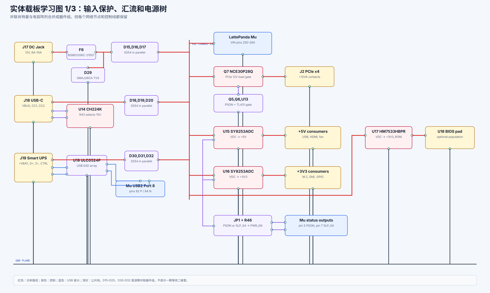](assets/physical_carrier/power_wiring.svg)

[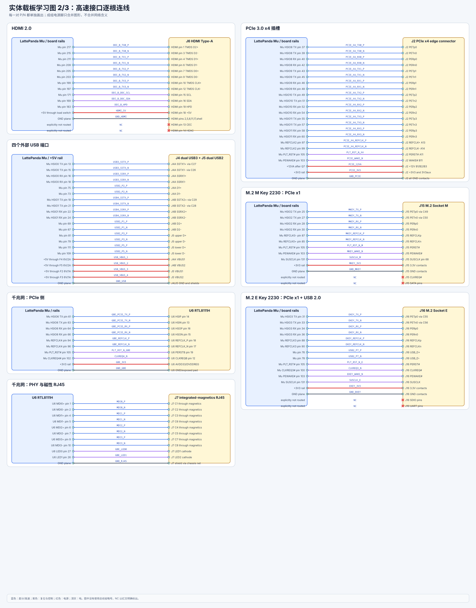](assets/physical_carrier/high_speed_wiring.svg)

[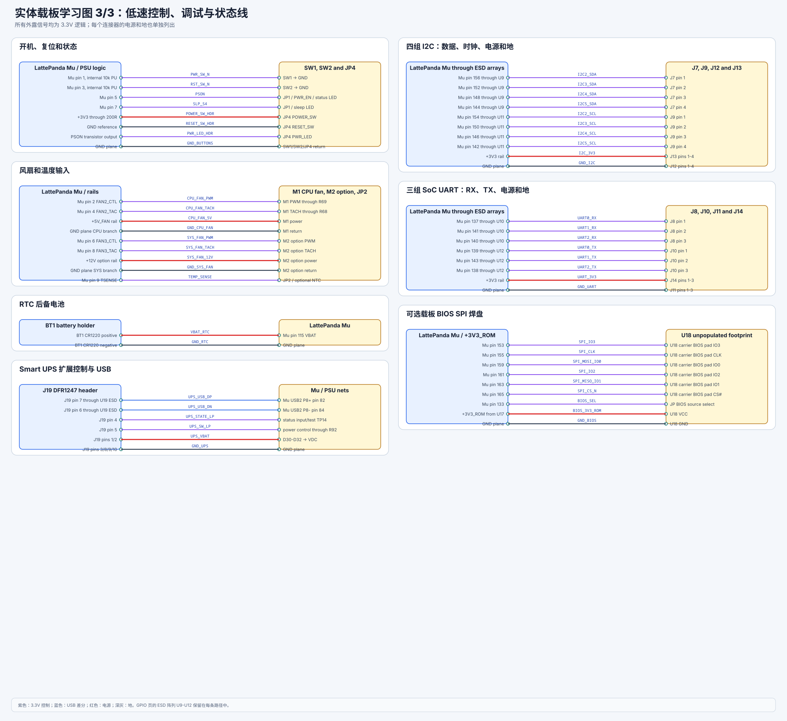](assets/physical_carrier/control_wiring.svg)

### 2.2 十页上游原理图

学习图用于理解，上游 KiCad 工程才是器件值、封装、DNP 状态和 PCB 网络的
事实来源。

| 页 | 原始图 | 内容 |
| ---: | --- | --- |
| 1 | [层次总图](assets/physical_carrier/reference/01_hierarchy.png) | 九个功能子页与模组之间的网络对应 |
| 2 | [模组连接器](assets/physical_carrier/reference/02_module_connector.png) | 260-pin 连接器、RTC、可选 SPI ROM 和复用说明 |
| 3 | [PCIe x4](assets/physical_carrier/reference/03_pcie_x4.png) | 四条 lane、参考时钟、复位、唤醒和插槽电源 |
| 4 | [HDMI](assets/physical_carrier/reference/04_hdmi.png) | 四对 TMDS、DDC、HPD、5 V 和 ESD |
| 5 | [USB](assets/physical_carrier/reference/05_usb.png) | 两个 USB 3.x、两个 USB 2.0、VBUS、保险丝和 ESD |
| 6 | [千兆以太网](assets/physical_carrier/reference/06_gigabit_ethernet.png) | PCIe 到 RTL8111H，再到四对 MDI 和磁性 RJ45 |
| 7 | [GPIO/UART/I2C](assets/physical_carrier/reference/07_gpio_uart_i2c.png) | 四组 I2C、三组 UART、电源/地排针和 ESD |
| 8 | [M.2](assets/physical_carrier/reference/08_m2.png) | M Key PCIe x1 与 E Key PCIe x1 + USB 2.0 |
| 9 | [电源](assets/physical_carrier/reference/09_power.png) | DC、USB-PD、UPS、降压、按键、状态和 PCIe 12 V |
| 10 | [风扇](assets/physical_carrier/reference/10_fan.png) | CPU/SYS 风扇 PWM、TACH、供电和温度输入 |

[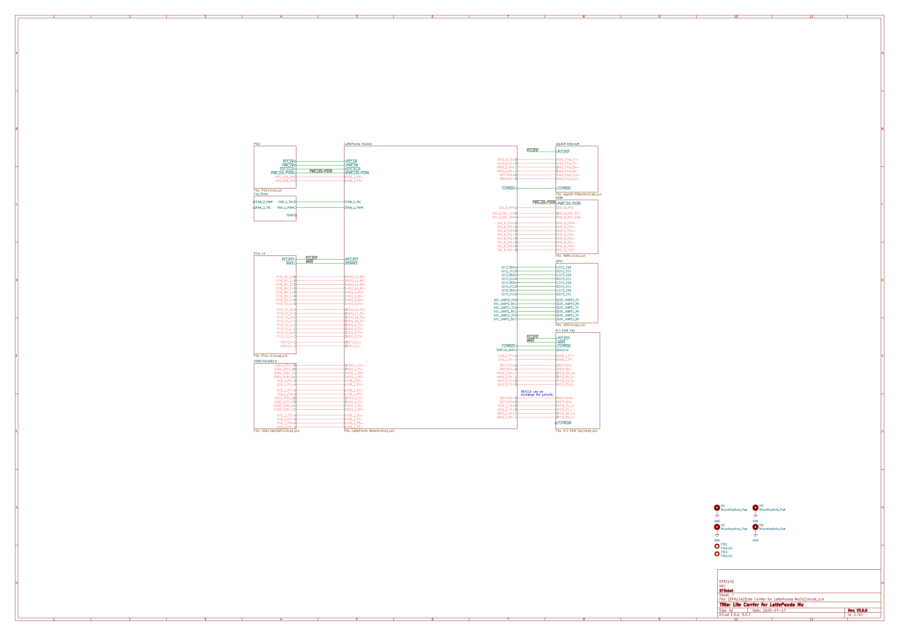](assets/physical_carrier/reference/01_hierarchy.png)

还可以直接打开：

- [十页原理图 PDF](../../hardware/lattepanda_mu_learning_carrier/upstream_dfr1142_v2/%5BDFR1142%5DLite%20Carrier%20for%20LattePanda%20Mu%28V2%29.pdf)
- [KiCad 工程](../../hardware/lattepanda_mu_learning_carrier/upstream_dfr1142_v2/%5BDFR1142%5DLite%20Carrier%20for%20LattePanda%20Mu%28V2%29.kicad_pro)
- [PCB 源文件](../../hardware/lattepanda_mu_learning_carrier/upstream_dfr1142_v2/%5BDFR1142%5DLite%20Carrier%20for%20LattePanda%20Mu%28V2%29.kicad_pcb)
- [260-pin 引脚表](../../hardware/lattepanda_mu_learning_carrier/module_pinout/LattePanda_Mu_Edge_Connector_Pinout.xlsx)
- [上游版本、许可证和 SHA-256 记录](../../hardware/lattepanda_mu_learning_carrier/provenance.md)

电气基线来自
[LattePandaTeam/LattePanda-Mu](https://github.com/LattePandaTeam/LattePanda-Mu)
公开仓库的 DFR1142 V2 参考工程，使用 MIT 许可证。本项目没有把上游设计换名
冒充原创；新增内容是本地归档、可缩放学习图、逐网说明和自动连通性门禁。

## 3. “简化但不省线”的具体规则

学习图和生产原理图之间采用以下转换规则：

1. 差分对的正、负线始终分别画出，例如 `HSIO8_TX_P` 和
   `HSIO8_TX_N` 是两根线。
2. PCIe x4 的 lane 0、1、2、3 全部展开，不用一根标成 `PCIe x4` 的粗线
   代替。
3. 同一电源网络的重复引脚可以合并成一行，但行内必须列出所有引脚号或引脚组。
4. 并联二极管、并联电容和 ESD 阵列可以合并成“器件组”，但器件位号必须保留，
   且器件组两侧网络不能改变。
5. 跨页网络标签等价于 EDA 中的导线，不等价于“猜测它们可能相连”。同名标签
   必须指向同一网络。
6. 未连接引脚不能消失，必须标为 `NC` 或说明原图中的 DNP/红叉状态。
7. 学习图不改变上游的器件值、方向、极性或信号分配。

自动检查命令：

```bash
python3 tools/check_learning_diagrams.py --self-test
```

检查器会验证：

- 每个可见引脚都有唯一 `data-pin`；
- 每个非 NC 引脚都有 `data-net`；
- 同网络导线必须真正经过引脚坐标；
- 每一段导线连通分量至少到达两个可见引脚；
- NC 引脚不能偷偷接线；
- 电路图中不得出现省略号占位；
- 原有七张系统图继续满足 8 px 卡片安全区。

三张 SVG 由以下命令确定性生成：

```bash
python3 tools/generate_physical_carrier_diagrams.py
```

## 4. 怎样读真实原理图

### 4.1 位号

位号的首字母表示器件类别：

| 前缀 | 器件 | 例子 |
| --- | --- | --- |
| `J` | 连接器 | `J17` DC Jack、`J18` USB-C、`J2` PCIe x4 |
| `U` | IC 或保护阵列 | `U14` CH224K、`U6` RTL8111H |
| `Q` | MOSFET/晶体管 | `Q7` PCIe 12 V 负载开关 |
| `D` | 二极管、TVS、ESD | `D29` SMAJ26CA、`D15-D20` SS54 |
| `F` | 保险丝 | `F6` DC 输入、`F2-F5` USB VBUS |
| `L` | 电感 | `L1/L2` 降压转换器储能电感 |
| `R` | 电阻 | 反馈、上拉、限流、配置 |
| `C` | 电容 | 去耦、储能、AC 耦合、补偿 |
| `SW` | 开关 | `SW1` 电源、`SW2` 复位 |
| `TP` | 测试点 | 上电时测量关键电源和控制网络 |

### 4.2 红叉、NC 和 DNP

上游图中被红叉覆盖的器件或引脚通常表示“不装”或“不连接”。它不是设计者忘了
画线，而是显式配置：

- M.2 M Key 的 SATA 和 `CLKREQ#` 在本设计中未使用；
- HDMI CEC/HEAC 没有接入模组；
- M.2 E Key 的 SDIO/UART 没有接入；
- 第二风扇和部分温度器件是可选项；
- 载板 SPI BIOS footprint 默认不装。

学习时要区分：

```text
NC  = 电气上明确不连接
DNP = PCB 上可能有焊盘，但装配时不贴器件
```

### 4.3 P/N 不能互相当作普通两根线

`TX_P/TX_N`、`RX_P/RX_N`、`REFCLK_P/REFCLK_N` 是差分对。原理图上的两根线
需要在 PCB 中共同满足：

- 受控差分阻抗；
- 对内长度匹配；
- 连续参考平面；
- 尽量少的过孔和层切换；
- 不跨地平面开槽；
- AC 耦合电容位置符合发送端要求；
- ESD 器件结电容适合对应速率。

正负极性并非在任何场景都可随意交换。M.2 M Key 的参考时钟在原图中做了明确
的 P/N 交换，属于已记录设计选择；不能因此推导所有差分网络都可交换。

## 5. 电源页：三路输入怎样汇成 VDC

[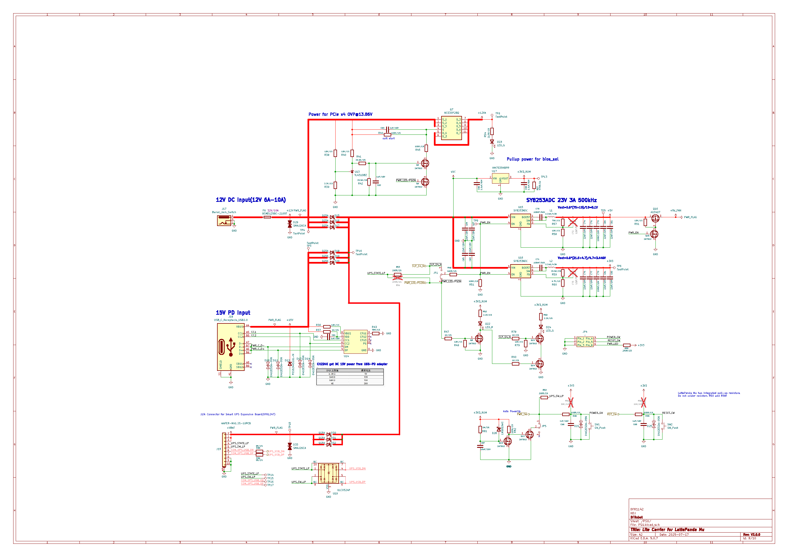](assets/physical_carrier/reference/09_power.png)

### 5.1 DC Jack 路径

主路径是：

```text
J17 pin 1
  → F6 BSMD1206C-2100T input protection
  → DC_FUSED
  → D15 || D16 || D17（SS54）
  → VDC
  → 模组 VIN 与板上转换器
```

`D29 SMAJ26CA` 从 `DC_FUSED` 接到 GND，负责钳位输入瞬态。TVS 必须靠近能量
进入点并拥有低电感回流；如果把它放在长而细的走线末端，原理图虽然相同，保护
效果会明显变差。

三颗 SS54 并联用于提高可用电流并降低每颗器件的热负担。实际器件不会绝对均流，
布局必须尽量对称。学习图把它画成 `D15,D16,D17` 器件组，但没有把它误写成
一颗“等效大二极管”。

模组 VIN 允许 9–20 V，但 PCIe 插槽的 12 V 轨需要正确的 12 V 输入条件。
不要把“模组能接受 20 V”误读成“板上所有 12 V 负载都能直接接受 20 V”。

### 5.2 USB-C PD 路径

```text
J18 CC1/CC2
  → U14 CH224K
  → R43 配置请求 15 V
  → J18 VBUS 成为 +15V
  → D18 || D19 || D20（SS54）
  → VDC
```

CH224K 是受电端协商芯片，不是降压转换器。它通过 CC1/CC2 请求电源适配器输出
目标电压，协商成功后 VBUS 才成为约 15 V。原图配置表给出 CFG 电阻与
9/12/15/20 V 档位的关系；本设计使用 15 V 档。

USB-C 外壳、GND、CC 和 VBUS 保护器件的回流路径必须分清。CC 是低速协议信号，
VBUS 是功率路径；不能因为都位于 Type-C 连接器就共用随意的细线。

### 5.3 Smart UPS 路径

```text
J19 +VBAT pins 1/2
  → D30 || D31 || D32（SS54）
  → VDC

J19 USB D+/D-
  → U19 ULC0524P ESD
  → Mu USB2 Port 8 pins 82/84
```

J19 还携带 `UPS_STATE_LP` 和 `UPS_SW_LP`。这说明 UPS 扩展不是只有一对电源线：
它同时有电源、状态、控制和 USB 数据。

### 5.4 三路汇流为什么使用肖特基

三路输入都通过肖特基二极管进入 `VDC`，形成简单的 diode-OR：

- 某一路电压最高时，它的二极管正向导通；
- 其他输入因输出端电压更高而反偏；
- 输入之间不应直接互相灌电；
- 代价是存在正向压降、损耗和发热。

这不是理想二极管控制器。计算最坏温升时至少考虑：

```text
P_loss ≈ I × V_f
```

并联器件还要考虑不均流，不能简单把三颗额定电流机械相加。

## 6. VDC 之后的电源树

| VDC 分支 | 核心器件 | 输出 | 主要负载 |
| --- | --- | --- | --- |
| 模组主电源 | 直接进入连接器 | 9–20 V VIN | Mu pins 250–260，连续 11 个触点 |
| PCIe 12 V | `Q7 NCE30P28Q` 与 `Q5/Q6/U13` 控制 | `+12VA` | PCIe x4 `J2` |
| 5 V | `U15 SY8253ADC`、`L1`、反馈和输出电容 | `+5V` | USB VBUS、HDMI、风扇 |
| 3.3 V | `U16 SY8253ADC`、`L2`、反馈和输出电容 | `+3V3` | M.2、RTL8111H、GPIO |
| BIOS 3.3 V | `U17 HM7533HBPR` | `+3V3_ROM` | 可选载板 SPI ROM |

### 6.1 SY8253 降压的闭合回路

学习图把每路降压画成一个器件块，原始页保留完整连接：

```text
VIN → U15/U16 internal switch → SW pin → L1/L2 → VOUT
VOUT → output capacitor bank → GND
VOUT → feedback divider → FB
PWR_EN → EN
U15/U16 GND → ground plane
```

PCB 上最关键的是高 `di/dt` 热回路：

```text
input capacitor → internal switch → SW → catch path → GND
```

它的面积必须小。FB 采样应从干净输出点 Kelvin 引出，远离 SW 铜皮和电感磁场。

### 6.2 `PWR_EN` 从哪里来

`JP1` 允许在 `PSON` 和 `SLP_S4` 相关状态之间选择，再经 `R46` 形成
`PWR_EN`，同时送入 U15/U16 的 EN。两路降压不是“只要插电就永远开启”，而是
受模组电源状态控制。

### 6.3 上电测量顺序

只用于学习时，也应按照真实 bring-up 顺序理解：

1. 不装模组，断电测量 VDC、5 V、3.3 V 对地阻值。
2. 限流供电，只验证输入保护和待机路径。
3. 验证 CH224K 实际协商到 15 V。
4. 测量 VDC，不应出现输入之间反灌。
5. 验证 `PWR_EN` 低/高时 U15/U16 的行为。
6. 验证 5 V、3.3 V 的静态值、纹波和启动波形。
7. 最后装模组，并继续保留限流和温度观察。

## 7. 260-pin 模组连接器

[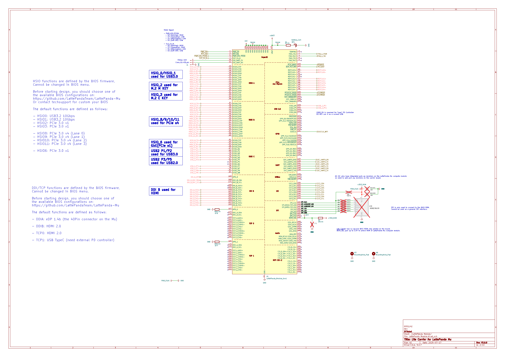](assets/physical_carrier/reference/02_module_connector.png)

### 7.1 电源与最早期控制脚

| 物理 pin | 信号 | 方向/电平 | 载板用途 |
| ---: | --- | --- | --- |
| 1 | `PWR_SW#` | 输入，3.3 V，内部 10 kΩ 上拉 | SW1/外接电源键拉低 |
| 3 | `RST_SW#` | 输入，3.3 V，内部 10 kΩ 上拉 | SW2/外接复位键拉低 |
| 5 | `PSON` | 输出，3.3 V | S0 状态、降压和状态灯控制 |
| 7 | `SLP_S4` | 输出，3.3 V | 睡眠/关机状态控制 |
| 9 | `TSENSE` | 输入，3.3 V | 可选 NTC |
| 115 | `VBAT` | 3.0 V 电源 | CR1220 RTC 后备 |
| 133 | `BIOS_SEL` | 输入，3.3 V | 集成 ROM/载板 ROM 选择 |
| 250–260 | `VIN` | 9–20 V | 11 个并联主电源触点 |

VIN 使用多个并联触点是为了降低单触点电阻和电流密度。GND 也在高速信号之间
大量穿插，用作回流和串扰隔离。不能只因为逻辑上“都是 GND”就在 PCB 上减少
连接器地脚。

### 7.2 本载板实际使用的 HSIO 分配

HSIO 的功能由 BIOS 配置决定。DFR1142 V2 的分配是：

| HSIO | 模组物理 pin | 载板用途 |
| --- | --- | --- |
| HSIO0 TX 13/15，RX 16/18 | 一对 TX + 一对 RX | USB 3.x 端口 1 |
| HSIO1 TX 19/21，RX 22/24 | 一对 TX + 一对 RX | USB 3.x 端口 2 |
| HSIO2 TX 25/27，RX 28/30 | PCIe x1 | M.2 M Key |
| HSIO3 TX 31/33，RX 34/36 | PCIe x1 | M.2 E Key |
| HSIO6 TX 61/63，RX 64/66 | PCIe x1 | RTL8111H 千兆网 |
| HSIO8 TX 37/39，RX 40/42 | PCIe lane 0 | PCIe x4 |
| HSIO9 TX 43/45，RX 46/48 | PCIe lane 1 | PCIe x4 |
| HSIO10 TX 49/51，RX 52/54 | PCIe lane 2 | PCIe x4 |
| HSIO11 TX 55/57，RX 58/60 | PCIe lane 3 | PCIe x4 |

如果换 BIOS 后某组 HSIO 被重新定义，原理图上的铜线不会自动改变，接口可能直接
失效。这也是“先锁 BIOS，再画载板”必须成为设计输入的原因。

## 8. HDMI：四对高速线加三条低速控制

[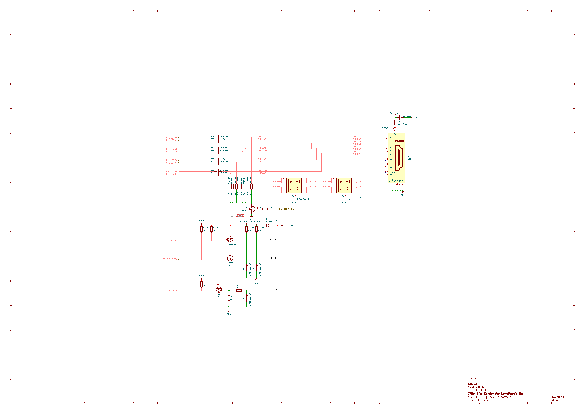](assets/physical_carrier/reference/04_hdmi.png)

| 模组 | 物理 pin | HDMI Type-A | 含义 |
| --- | ---: | --- | --- |
| `DDI_B_TX0_P/N` | 217/215 | pins 1/3 | TMDS Data2 P/N |
| `DDI_B_TX1_P/N` | 211/209 | pins 4/6 | TMDS Data1 P/N |
| `DDI_B_TX2_P/N` | 205/203 | pins 7/9 | TMDS Data0 P/N |
| `DDI_B_TX3_P/N` | 199/197 | pins 10/12 | TMDS Clock P/N |
| `DDI_B_DDC_SCL` | 171 | pin 15 | 显示器 EDID 时钟 |
| `DDI_B_DDC_SDA` | 169 | pin 16 | 显示器 EDID 数据 |
| `DDI_B_HPD` | 183 | pin 19 | 热插拔检测 |
| `HDMI_5V` | 板上 5 V | pin 18 | HDMI 5 V |
| GND | 地平面 | pins 2/5/8/11/17、外壳 | 差分回流与屏蔽 |

CEC pin 13 和 HEAC/reserved pin 14 明确 NC。学习图用红叉画出，而不是把它们从
连接器上删除。

## 9. USB：两组 SuperSpeed 加两组 USB 2.0

[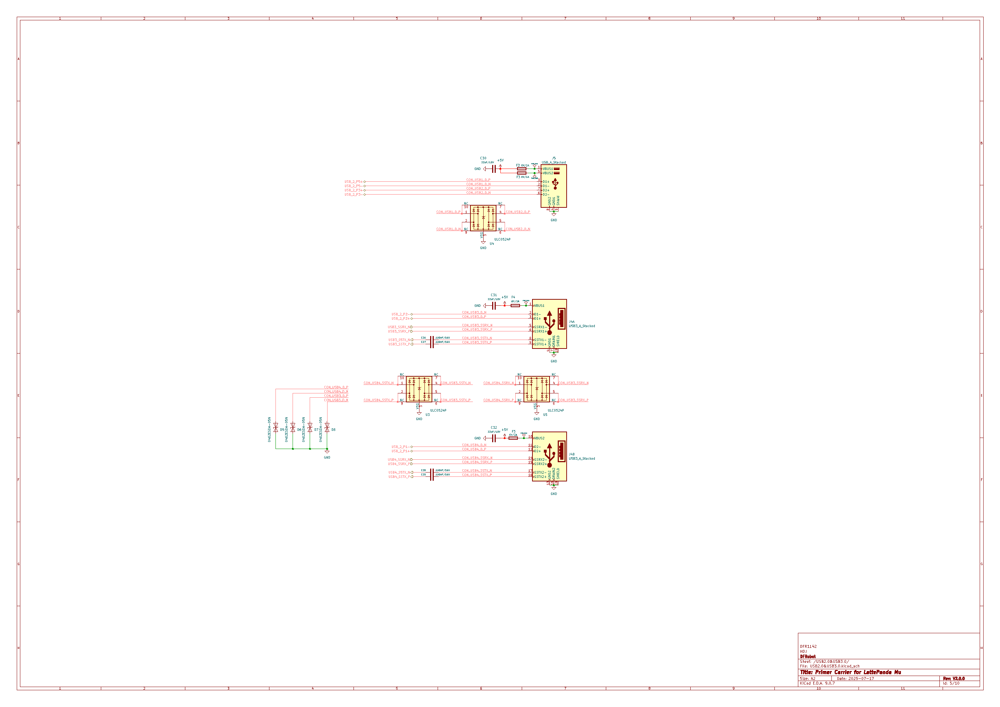](assets/physical_carrier/reference/05_usb.png)

### 9.1 两个 USB 3.x 端口

| 端口 | SuperSpeed TX | SuperSpeed RX | USB 2.0 |
| --- | --- | --- | --- |
| J4A | HSIO0 pins 13/15，经 C27/C26 AC 耦合 | HSIO0 pins 16/18 | Port 2 pins 75/73 |
| J4B | HSIO1 pins 19/21，经 C29/C28 AC 耦合 | HSIO1 pins 22/24 | Port 1 pins 69/67 |

SuperSpeed 的 TX 与 RX 不能互换：相对于模组，TX 是输出，RX 是输入。AC 耦合
电容放在发送方向，原图分别标出 `C26-C29`。

### 9.2 两个 USB 2.0 端口

| 端口 | D+ | D- |
| --- | ---: | ---: |
| J5 上层 | Mu Port 3 pin 81 | Mu Port 3 pin 79 |
| J5 下层 | Mu Port 5 pin 111 | Mu Port 5 pin 109 |

四个 VBUS 分别经 F2、F3、F4、F5 从 +5 V 进入连接器。四组 D+/D- 都经过 ESD
器件。VBUS、数据地和屏蔽壳的布局职责不同，不能把“都接 GND”理解为任意回流。

## 10. PCIe x4：四条 lane 必须全部展开

[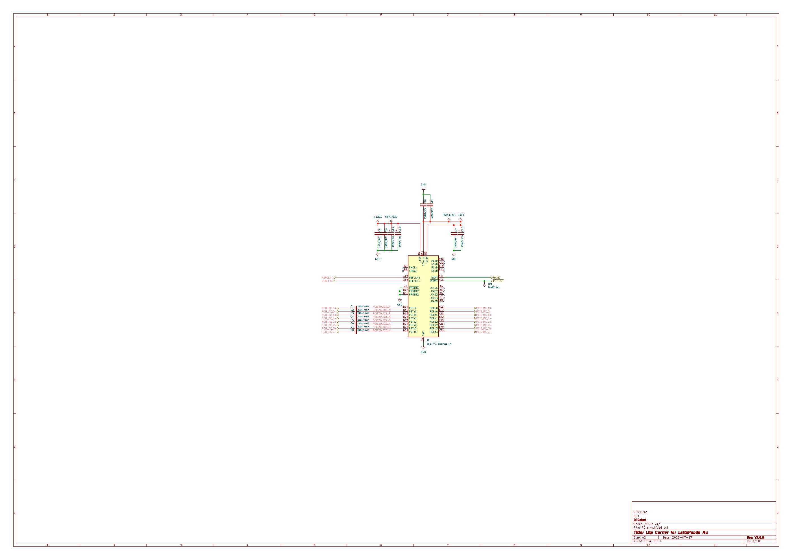](assets/physical_carrier/reference/03_pcie_x4.png)

| Lane | 模组 TX P/N | 插槽 | 模组 RX P/N | 插槽 |
| ---: | --- | --- | --- | --- |
| 0 | HSIO8 pins 37/39 | `PETp0/PETn0` | HSIO8 pins 40/42 | `PERp0/PERn0` |
| 1 | HSIO9 pins 43/45 | `PETp1/PETn1` | HSIO9 pins 46/48 | `PERp1/PERn1` |
| 2 | HSIO10 pins 49/51 | `PETp2/PETn2` | HSIO10 pins 52/54 | `PERp2/PERn2` |
| 3 | HSIO11 pins 55/57 | `PETp3/PETn3` | HSIO11 pins 58/60 | `PERp3/PERn3` |

附加网络：

| 网络 | 模组 pin | 插槽用途 |
| --- | ---: | --- |
| `REFCLK2_P/N` | 97/99 | 100 MHz `REFCLK+/-` |
| `PLT_RST#` | 105 | `PERST#` |
| `PEWAKE#` | 103 | `WAKE#` |
| `+12VA` | Q7 输出 | 插槽 12 V |
| `+3V3` | U16 输出 | 3.3 V 与 3.3 Vaux |
| GND | 地平面 | 所有规定 GND 触点 |

TX 线上 `C1-C8` 是 AC 耦合电容。插槽的存在检测、JTAG 和保留脚按规范处理；
学习图只把明确未用的脚标成 NC，不把 lane 合并成一条总线。

## 11. M.2：两个插槽不是同一种接法

[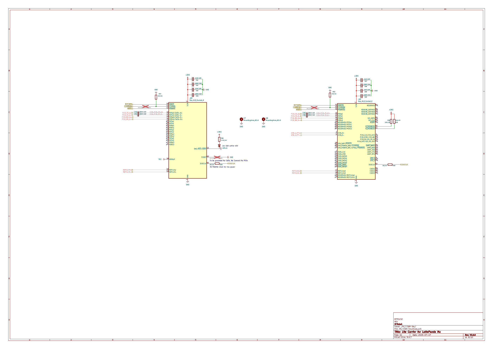](assets/physical_carrier/reference/08_m2.png)

### 11.1 M Key

| 功能 | 模组来源 | J15 |
| --- | --- | --- |
| PCIe TX P/N | HSIO2 pins 25/27，经 C49/C50 | PETp0/PETn0 |
| PCIe RX P/N | HSIO2 pins 28/30 | PERp0/PERn0 |
| Reference Clock | REFCLK0 pins 85/87，原图交换 P/N | REFCLKp/n |
| Reset | PLT_RST# pin 105 | PERST# |
| Wake | PEWAKE# pin 103 | PEWAKE# |
| Suspend clock | SUSCLK pin 131 | SUSCLK |
| Power | +3V3/GND | 所有规定触点 |

本载板把 M Key 用作 PCIe x1，不接 SATA。`CLKREQ#` 也明确未接。

### 11.2 E Key

| 功能 | 模组来源 | J16 |
| --- | --- | --- |
| PCIe TX P/N | HSIO3 pins 31/33，经 C55/C56 | PETp0/PETn0 |
| PCIe RX P/N | HSIO3 pins 34/36 | PERp0/PERn0 |
| Reference Clock | REFCLK3 pins 88/90 | REFCLKp/n |
| USB D+/D- | USB2 Port 7 pins 76/78 | USB_D+/USB_D- |
| Clock request | CLKREQ3# pin 100 | CLKREQ# |
| Reset/Wake | PLT_RST# pin 105 / PEWAKE# pin 103 | PERST#/PEWAKE# |
| Suspend clock | SUSCLK pin 131 | SUSCLK |
| Power | +3V3/GND | 所有规定触点 |

E Key 的 SDIO 和 UART 脚在本设计中 NC。Wi-Fi/蓝牙卡常同时使用 PCIe 和
USB：PCIe 可承载 Wi-Fi，USB 可承载蓝牙，所以只接 PCIe 并不一定得到完整
功能。

## 12. 千兆网：PCIe 控制器和以太网 PHY 在同一颗芯片里

[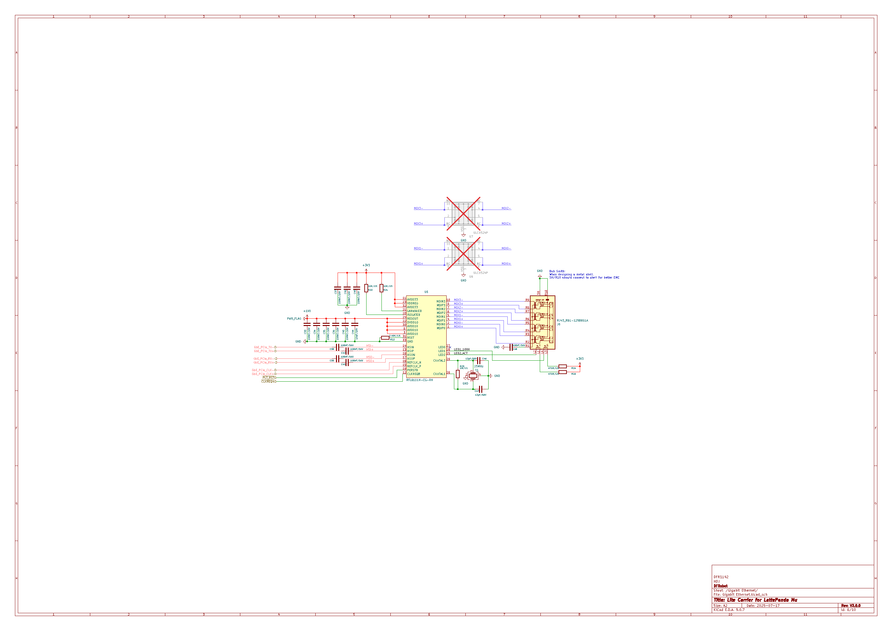](assets/physical_carrier/reference/06_gigabit_ethernet.png)

第一段是模组到 RTL8111H：

| 模组 | pin | U6 RTL8111H |
| --- | ---: | --- |
| HSIO6 TX P/N | 61/63 | HSIP/HSIN |
| HSIO6 RX P/N | 64/66 | HSOP/HSON |
| REFCLK4 P/N | 94/96 | REFCLK_P/N |
| PLT_RST# | 105 | PERSTB |
| CLKREQ4# | 102 | CLKREQB |

第二段是 RTL8111H 到集成磁性 RJ45：

```text
U6 MDI0 P/N → J7 pair 0 magnetics
U6 MDI1 P/N → J7 pair 1 magnetics
U6 MDI2 P/N → J7 pair 2 magnetics
U6 MDI3 P/N → J7 pair 3 magnetics
U6 LED0/LED1 → J7 link/activity LEDs
```

以太网侧不能绕过隔离磁性器件直接接网线。RJ45 shield/机壳地和数字 GND 的
连接方式影响 EMC，原图旁边也明确提示金属外壳的处理。

## 13. 低速控制、调试和状态

### 13.1 四组 I2C

[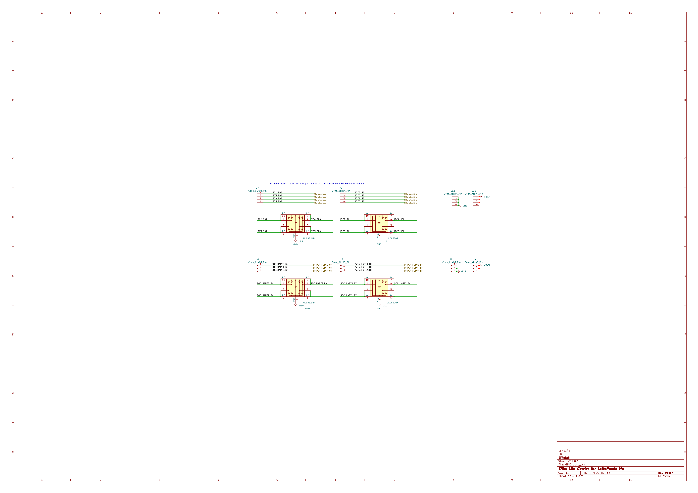](assets/physical_carrier/reference/07_gpio_uart_i2c.png)

| 总线 | SCL pin → J9 | SDA pin → J7 |
| ---: | --- | --- |
| I2C2 | 154 → pin 1 | 156 → pin 1 |
| I2C3 | 150 → pin 2 | 152 → pin 2 |
| I2C4 | 146 → pin 3 | 148 → pin 3 |
| I2C5 | 142 → pin 4 | 144 → pin 4 |

SCL/SDA 经过 U9/U11 ESD 阵列。J13 提供四个 +3V3，J12 提供四个 GND。模组
内部已有 2.2 kΩ 上拉，不能不看总线电容和外设上拉就重复并联很多低阻上拉。

### 13.2 三组 SoC UART

| UART | RX pin → J8 | TX pin → J10 |
| ---: | --- | --- |
| UART0 | 137 → pin 1 | 139 → pin 1 |
| UART1 | 141 → pin 2 | 143 → pin 2 |
| UART2 | 140 → pin 3 | 138 → pin 3 |

J14 提供 +3V3，J11 提供 GND；信号经过 U10/U12 ESD。这里是 3.3 V CMOS UART，
不是 ±12 V RS-232，不能直接接传统 DB9 电平。

### 13.3 按键、风扇和 RTC

[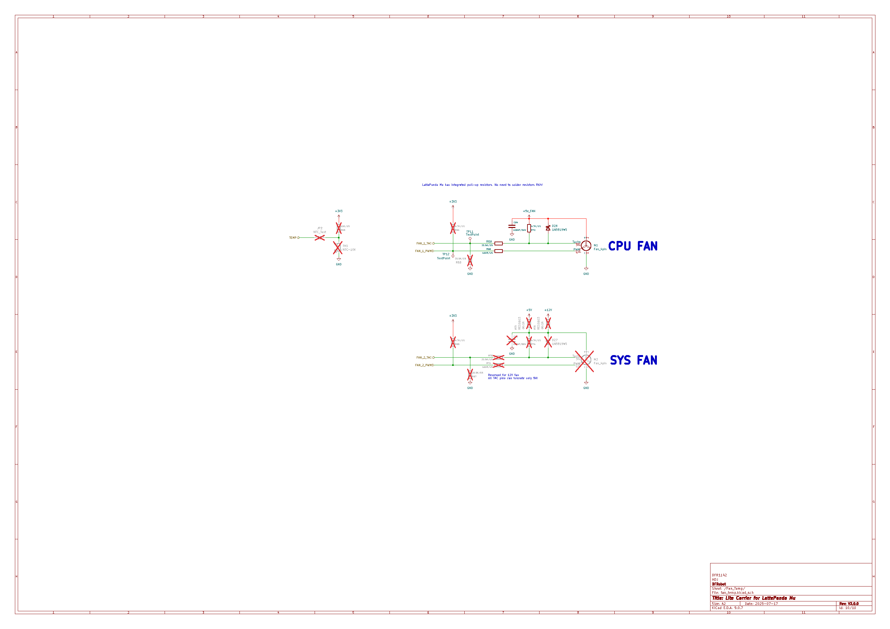](assets/physical_carrier/reference/10_fan.png)

| 功能 | 模组 pin | 外部 |
| --- | ---: | --- |
| 电源键 | 1 `PWR_SW#` | SW1/JP4 拉低 |
| 复位键 | 3 `RST_SW#` | SW2/JP4 拉低 |
| CPU 风扇 PWM | 2 | M1 PWM |
| CPU 风扇 TACH | 4 | M1 TACH |
| SYS 风扇 PWM | 6 | M2 可选 |
| SYS 风扇 TACH | 8 | M2 可选 |
| 温度输入 | 9 | JP2/可选 NTC |
| RTC 电池 | 115 `VBAT` | CR1220 正极 |

PWM 是模组输出，TACH 是模组输入。风扇 TACH 电平与上拉必须核对；原图特别标注
风扇控制输入只允许 3.3 V 逻辑。

### 13.4 可选载板 BIOS

载板为外部 SPI ROM 预留：

```text
pin 153 SPI_IO3
pin 155 SPI_CLK
pin 159 SPI_MOSI / IO0
pin 161 SPI_IO2
pin 163 SPI_MISO / IO1
pin 165 SPI_CS#
pin 133 BIOS_SEL
+3V3_ROM / GND
```

该 footprint 默认不装。它是高级调试入口，不是当前 STUOS 自定义 128 KiB ROM
可以直接烧入并启动的等价接口。

## 14. 没有接出的模组功能也必须知道

260-pin 接口还有本载板未使用的公开功能：

- USB2 Port 4、6；
- TCP0/TCP1 的复用 DisplayPort/HDMI/Type-C 高速通道；
- I2S 1.8 V 音频；
- HDA 3.3 V 音频；
- CSI C/D 摄像头通道；
- 部分 GPIO、SMBus、SMLink 和 TPM 信号；
- M.2 插槽中的 SATA、SDIO、UART 或保留功能。

这些功能没有在学习图里伪装成“已经接好”。需要它们时，应回到完整引脚表、
选择匹配 BIOS 功能，再新增原理图页和 PCB 约束。

## 15. 从原理图到四层 PCB

该 PCB 源文件包含 305 个 footprint、407 个网络、3961 段走线和 1307 个
过孔。板厚约 1.6062 mm，叠层为：

```text
F.Cu    35 µm
prepreg 0.2104 mm
In1.Cu  15.2 µm   主要连续 GND 参考
core    1.065 mm
In2.Cu  15.2 µm   电源/辅助参考
prepreg 0.2104 mm
B.Cu    35 µm
```

“四层”本身不能保证高速接口工作。制造前必须基于板厂实际材料重新计算阻抗，
并检查：

1. HDMI、USB、PCIe 和 MDI 每对线的阻抗与长度；
2. 每次换层附近是否有回流过孔；
3. 高速线下方参考平面是否连续；
4. AC 耦合电容是否位于正确发送端；
5. ESD 是否靠近连接器而不是靠近模组；
6. VDC、12 V、5 V 大电流铜宽和温升；
7. SY8253 的输入热回路、SW 节点和 FB 采样；
8. 连接器外壳、散热器、模组卡扣和机箱干涉。

详细生产检查见
[hardware/lattepanda_mu_learning_carrier/manufacturing_checklist.md](../../hardware/lattepanda_mu_learning_carrier/manufacturing_checklist.md)。

## 16. 它和当前 QEMU/STUOS 哪里相同，哪里不同

### 16.1 相同的架构基础

- 都执行 x86-64 指令；
- 都有物理地址、分页、异常、中断和 PCI/PCIe 设备概念；
- 都需要固件把 CPU 从复位状态带到可装载 OS 的环境；
- 都需要内核枚举硬件、管理内存和驱动设备。

### 16.2 当前不能直接替换的部分

| 当前 STUOS/QEMU | 实体 N100 载板 |
| --- | --- |
| `-machine pc,accel=tcg` | Intel N100/N305 平台、ACPI 和真实 PCIe 拓扑 |
| 自研 128 KiB ROM 映射到 4 GiB 顶端 | 模组自带 UEFI/BIOS 和平台初始化 |
| legacy ATA PIO `0x1F0` | 主要是 eMMC/NVMe/USB 存储 |
| 8259A + PIT + PS/2 | 实机通常依赖 APIC、ACPI、HPET/现代定时器和 USB HID |
| COM1 端口 `0x3F8` | 需要确认板上 UART 与固件是否暴露传统 COM 语义 |
| QEMU `fw_cfg` 提供 E820 | UEFI/BIOS 通过标准固件接口和 ACPI 提供信息 |
| `-bios` 直接装入自研 ROM | 不能覆盖模组必需的硅初始化和平台固件 |

当前 STUOS 不能把现有 ROM 直接写入 U18 就启动。要运行在这类实机上，至少需要：

1. 增加 UEFI PE/COFF 启动入口或一个明确的 UEFI 引导层；
2. 读取 UEFI Memory Map 并形成 BootInfo；
3. 解析 ACPI MADT/HPET/MCFG 等平台表；
4. 枚举 PCIe；
5. 选择 GOP framebuffer 或经过验证的 UART 作为早期控制台；
6. 增加 NVMe/eMMC/USB 中至少一种启动存储路径；
7. 增加 USB HID 或其他现实输入驱动；
8. 保留 QEMU 自研 ROM 路线作为独立的教学平台，而不是悄悄用 UEFI 取代它。

## 17. 推荐学习顺序

### 第一次：只追电源

从 J17/J18/J19 出发，手画：

```text
input → protection → diode OR → VDC
VDC → Mu VIN
VDC → +12VA
VDC → +5V
VDC → +3V3
VDC → +3V3_ROM
```

然后在原图找出每个测试点、保险丝、TVS、肖特基、EN 和 GND。

### 第二次：只追一条 PCIe lane

选择 HSIO8：

```text
Mu TX P/N → AC coupling → J2 PETp0/PETn0
J2 PERp0/PERn0 → Mu RX P/N
Mu REFCLK2 P/N → J2 REFCLK P/N
Mu PLT_RST# → J2 PERST#
J2 WAKE# → Mu PEWAKE#
```

能完整解释 lane 0 后，再验证 lane 1–3 没有被图形合并。

### 第三次：只追一根外部输入

选择电源键：

```text
Mu pin 1 internal pull-up
  → PWR_SW#
  → RC/ESD network
  → SW1
  → GND
```

再对 RESET、UART RX 和 I2C SDA 重复同样方法。

### 第四次：回到 PCB

在 KiCad 中高亮同一网络，检查原理图连接是否真的变成：

- 正确 footprint pad；
- 连续铜线；
- 合理参考平面；
- 合理回流；
- 正确连接器 pin；
- 没有意外 dangling net。

## 18. 学习验收

读完本章后，应能不看答案解释：

1. 为什么 QEMU 图不能当作电子原理图？
2. 为什么计算模组在工程上可以作为一个 260-pin 器件？
3. 三路电源怎样避免直接互相反灌？
4. CH224K 做的是协商还是降压？
5. 为什么模组 VIN 能接受 20 V，不代表 PCIe 插槽能接受 20 V？
6. PCIe x4 实际包含多少根高速单端铜线？
7. 为什么 USB 3.x 同时需要 SuperSpeed 和 USB 2.0 D+/D-？
8. M.2 M Key 与 E Key 分别使用哪组 HSIO？
9. RTL8111H 前面为什么是三对 PCIe 信号，后面为什么是四对 MDI？
10. UART 为什么不能直接接 RS-232 电平？
11. 同名网络标签为什么是连接，而 NC 红叉为什么不是连接？
12. 为什么现有 STUOS ROM 不能直接替换模组 UEFI？

只有能沿原始页、学习 SVG、260-pin 表和 PCB 四份证据互相核对，才算真正理解
这块实体载板。
